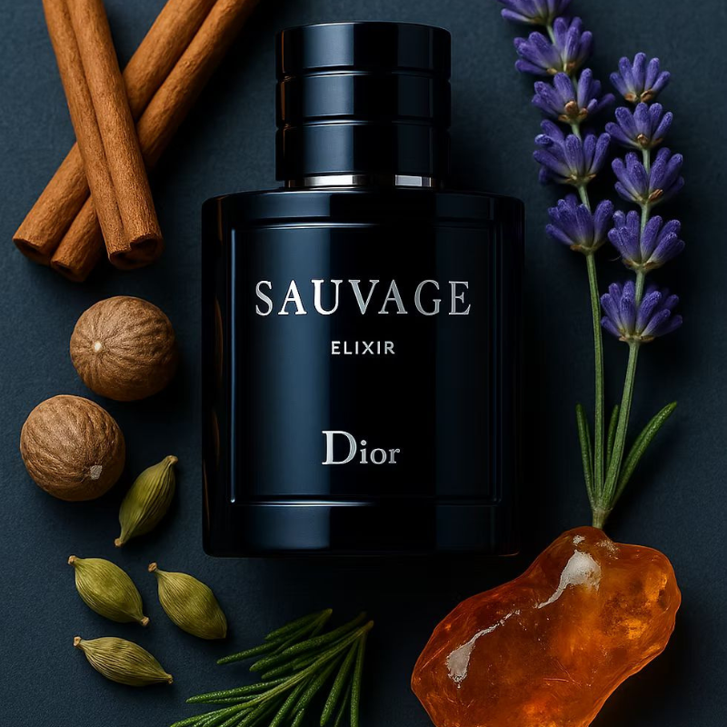
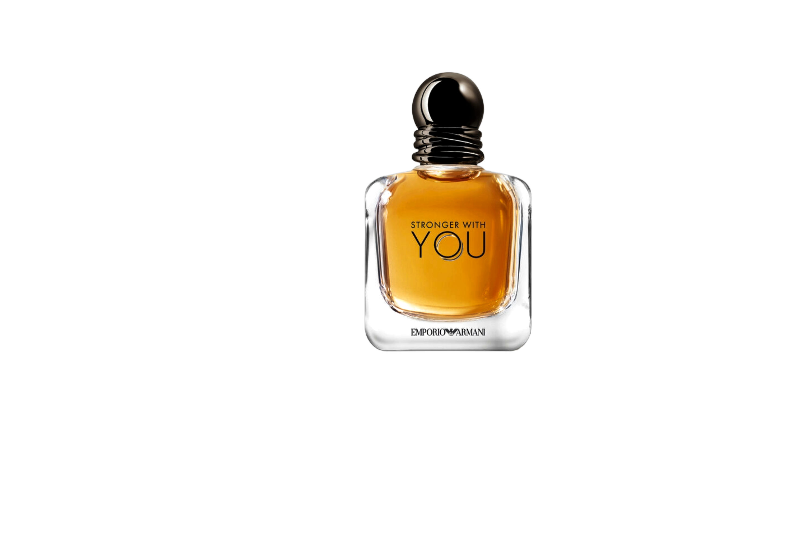
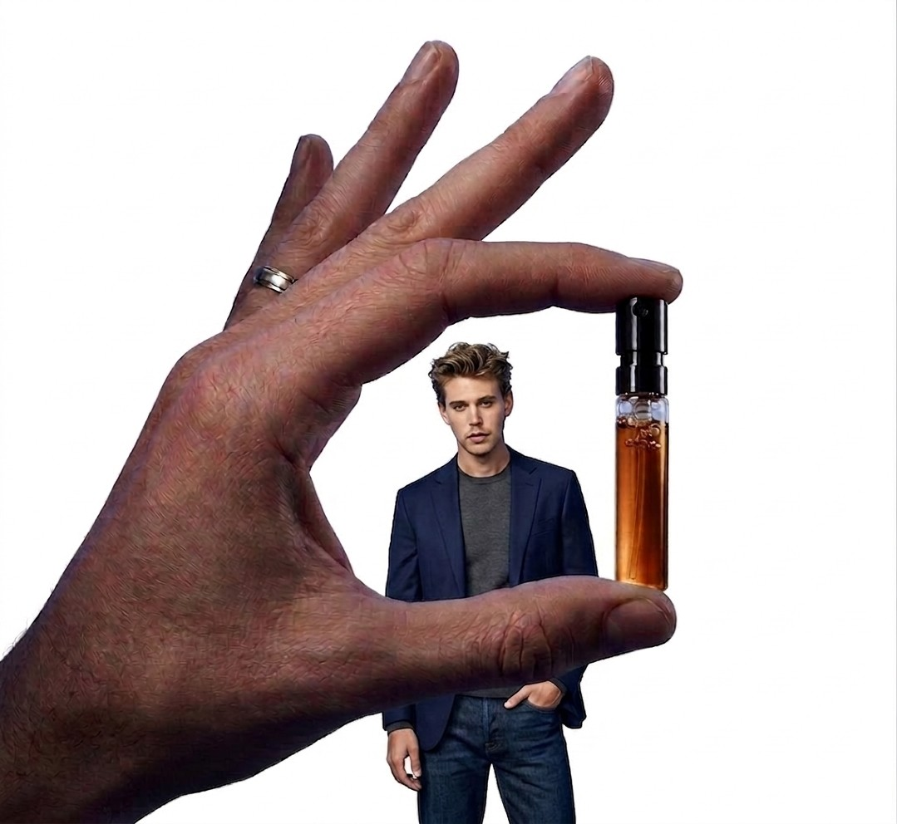
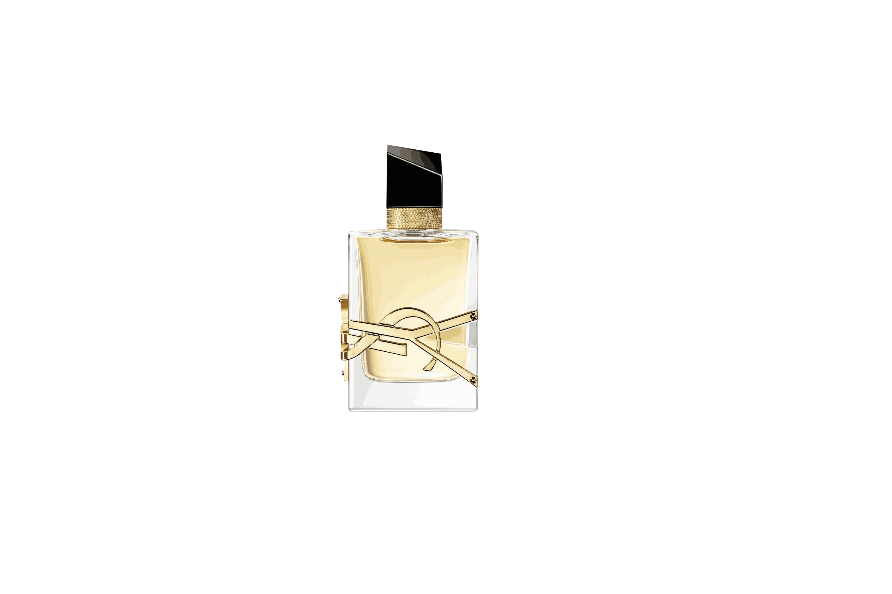
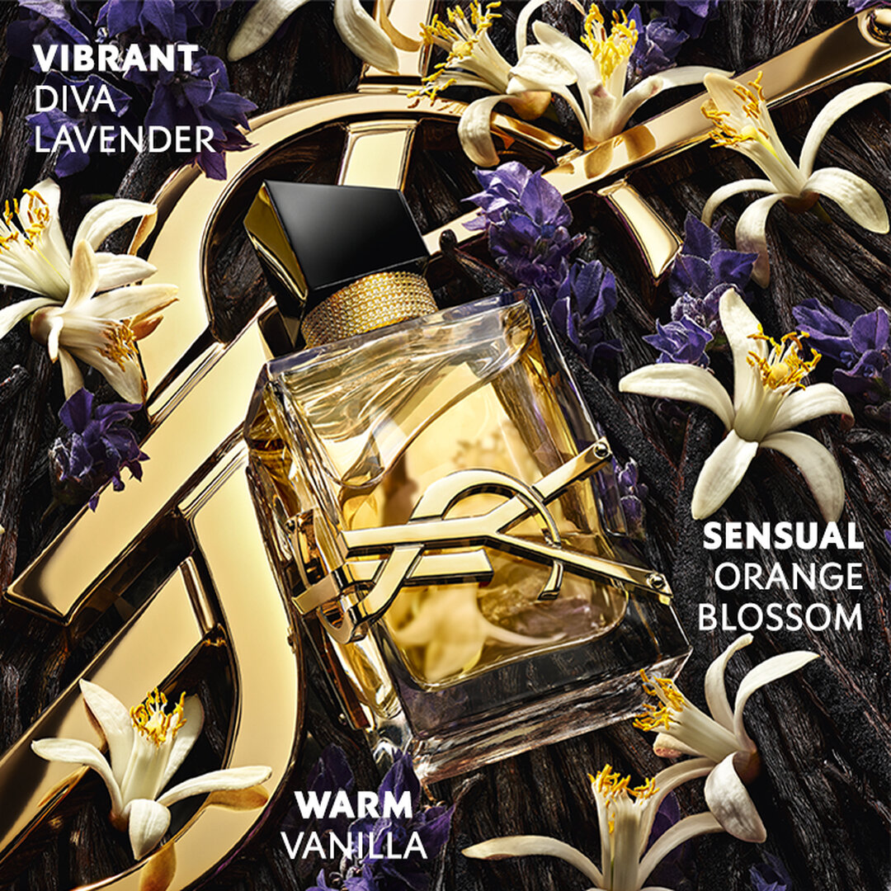
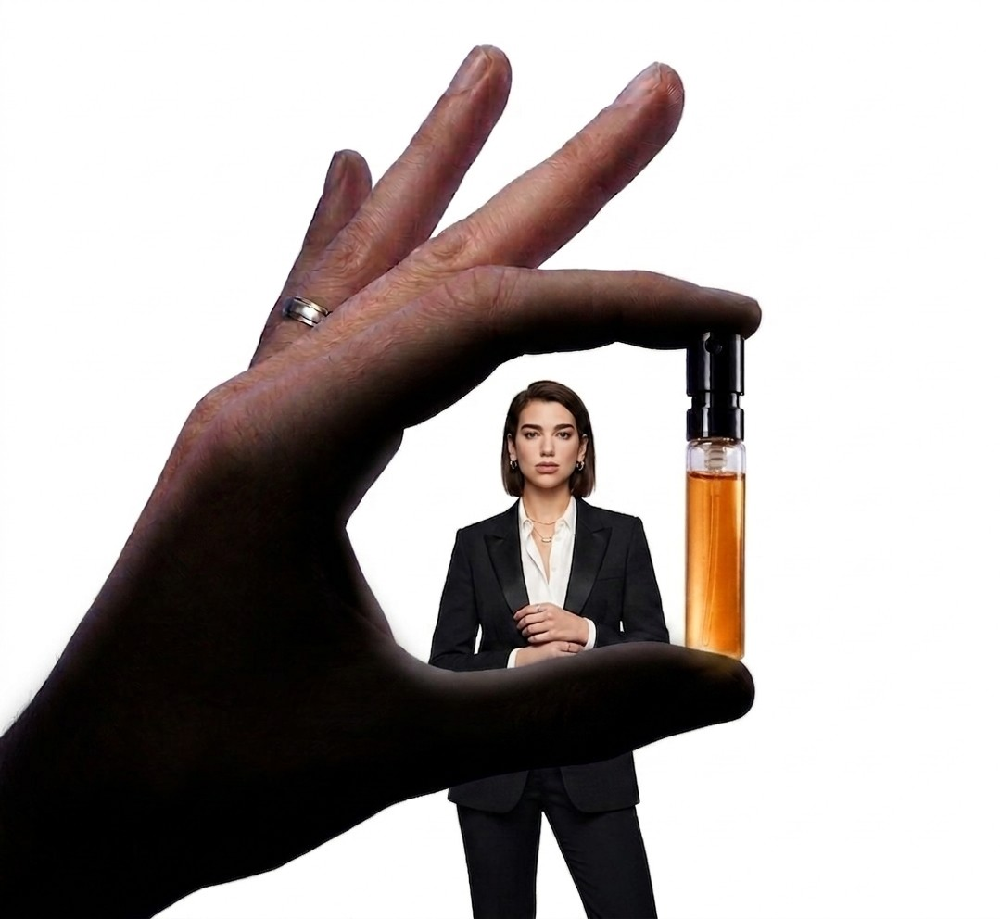
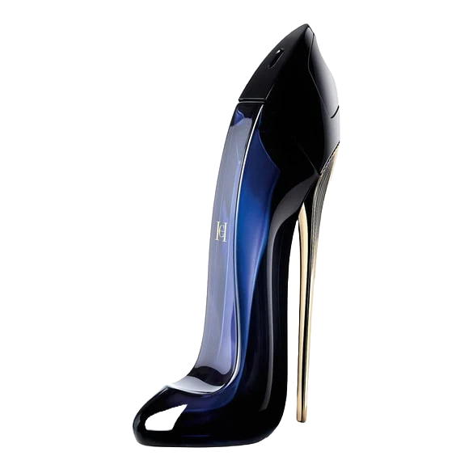

<html lang="en">
<head>
  <!-- Google tag (gtag.js) -->
  
  

  <meta charset="UTF-8">
  <meta name="viewport" content="width=device-width, initial-scale=1.0, maximum-scale=1.0, user-scalable=no">
  <title>Velooria Beauty | Official Luxury Collection</title>
  <link href="https://fonts.googleapis.com/css2?family=Cinzel:wght@400;700&family=Montserrat:wght@200;400;600&display=swap" rel="stylesheet">

  
</head>
<body>

  
VELOORIA

  

  <!-- ══════════════════════════════════════════════════════════════
       🐱  CAT WIDGET  —  fixed bottom-right
       Click → meow sound → WhatsApp redirect
       Speech bubble in Arabic, Montserrat font
  ══════════════════════════════════════════════════════════════ -->
  

    <!-- Arabic speech bubble (Montserrat, RTL) -->
    
إلى بغيتي تواصل معانا ورك عليا

    <!-- Inline SVG cat — renders sharp on all devices, no external file needed -->
    <svg id="velooria-cat-svg" viewBox="0 0 100 100" xmlns="http://www.w3.org/2000/svg">

      <!-- Tail (right side — mirrored from left version) -->
      <g id="cat-tail">
        <path d="M72 78 Q90 90 86 73 Q82 60 72 72"
              fill="rgba(255,255,255,0.85)"/>
      </g>

      <!-- Body -->
      <ellipse cx="50" cy="72" rx="26" ry="22" fill="rgba(255,255,255,0.91)"/>

      <!-- Head -->
      <ellipse cx="50" cy="44" rx="22" ry="20" fill="rgba(255,255,255,0.95)"/>

      <!-- Left ear (with twitch animation) -->
      <g id="cat-ear-l">
        <polygon points="30,30 36,14 44,28"  fill="rgba(255,255,255,0.95)"/>
        <polygon points="33,28 37,18 42,27"  fill="rgba(255,185,185,0.40)"/>
      </g>

      <!-- Right ear -->
      <polygon points="70,30 64,14 56,28"  fill="rgba(255,255,255,0.95)"/>
      <polygon points="67,28 63,18 58,27"  fill="rgba(255,185,185,0.40)"/>

      <!-- Left eye (with blink animation) -->
      <g id="cat-eye-l">
        <ellipse cx="42" cy="43" rx="4" ry="4.6" fill="rgba(15,15,15,0.90)"/>
        <ellipse cx="43.6" cy="41.4" rx="1.3" ry="1.3" fill="rgba(255,255,255,0.96)"/>
      </g>

      <!-- Right eye -->
      <g id="cat-eye-r">
        <ellipse cx="58" cy="43" rx="4" ry="4.6" fill="rgba(15,15,15,0.90)"/>
        <ellipse cx="59.6" cy="41.4" rx="1.3" ry="1.3" fill="rgba(255,255,255,0.96)"/>
      </g>

      <!-- Nose -->
      <polygon points="50,50 47.5,53 52.5,53" fill="rgba(255,150,150,0.78)"/>

      <!-- Mouth -->
      <path d="M47.5 53 Q50 57.5 52.5 53"
            stroke="rgba(100,50,50,0.55)" stroke-width="0.8" fill="none"/>

      <!-- Whiskers left -->
      <line x1="48" y1="51" x2="27" y2="48" stroke="rgba(210,210,210,0.55)" stroke-width="0.75"/>
      <line x1="48" y1="53" x2="27" y2="53" stroke="rgba(210,210,210,0.55)" stroke-width="0.75"/>
      <line x1="48" y1="55" x2="27" y2="58" stroke="rgba(210,210,210,0.55)" stroke-width="0.75"/>

      <!-- Whiskers right -->
      <line x1="52" y1="51" x2="73" y2="48" stroke="rgba(210,210,210,0.55)" stroke-width="0.75"/>
      <line x1="52" y1="53" x2="73" y2="53" stroke="rgba(210,210,210,0.55)" stroke-width="0.75"/>
      <line x1="52" y1="55" x2="73" y2="58" stroke="rgba(210,210,210,0.55)" stroke-width="0.75"/>

      <!-- Paws -->
      <ellipse cx="35" cy="90" rx="7.5" ry="5" fill="rgba(255,255,255,0.88)"/>
      <ellipse cx="65" cy="90" rx="7.5" ry="5" fill="rgba(255,255,255,0.88)"/>

      <!-- Gold collar — Velooria brand accent -->
      <path d="M30 60 Q50 66 70 60"
            stroke="rgba(212,175,55,0.80)" stroke-width="3.8" fill="none" stroke-linecap="round"/>
      <!-- Collar gem -->
      <circle cx="50" cy="63" r="3.2" fill="rgba(212,175,55,0.93)"/>
      <circle cx="50" cy="63" r="1.6" fill="rgba(255,243,192,0.99)"/>
    </svg>

  
<!-- /#cat-widget -->

  <!-- ══════════════════════════════════════════════════════════════
       PRODUCT SECTIONS — 100% unchanged from original
  ══════════════════════════════════════════════════════════════ -->

  <section class="product-section sauv-t" id="sec1">
    

    
<video autoplay muted loop playsinline class="bg-v"><source src="assets/sauvage.mp4" type="video/mp4"></video>

    

      
      <h1 class="brand-logo">SAUVAGE ELIXIR</h1>
      
EXTRAIT DE PARFUM

    

    

      

      

        <h3>THE LEGENDARY DEPTH</h3>
        
Sauvage Elixir is an extraordinary concentration, a masterpiece of wild freshness. It intoxicates the senses with a custom-made heart of spices and a rich, woody trail that lingers long after you leave the room.

      

    

    

      

      

        <h3>OFFICIAL COMPOSITION</h3>
        
Notes: A powerful blend of Nutmeg, Cinnamon, and Cardamom, balanced perfectly by the freshness of Grapefruit and the warmth of Licorice.

      

    

    

      

        

          
<h4 style="font-family:'Cinzel'">SAUVAGE ELIXIR</h4>
10ML / 319 DH

          
        

        

          
5ML± 80 SPRAYS

          
10ML± 160 SPRAYS

        

      

      
<form><input name="name" placeholder="FULL NAME"><input name="phone" placeholder="PHONE NUMBER"><input name="city" placeholder="CITY"><button type="button" class="order-btn" onclick="sendOrder('sec1','SAUVAGE ELIXIR')">ORDER NOW | 319 DH</button></form>

    

  </section>

  <section class="product-section stron-t" id="sec2">
    

    
<video autoplay muted loop playsinline class="bg-v"><source src="assets/stronger.mp4" type="video/mp4"></video>

    

      
      <h1 class="brand-logo">STRONGER WITH YOU</h1>
      
EAU DE PARFUM

    

    

      

      

        <h3>MAGNETIC SENSUALITY</h3>
        
Stronger With You lives in the present, molded by the energy of modernity. Unpredictable, it surprises with its originality, like the spicy accord in the top notes—a mix of cardamom, pink peppercorn, and violet leaves.

      

    

    

      

      

        <h3>OLFACTORY ARCHITECTURE</h3>
        
Heart: The aromatic heart consists of Sage and Lavender, bringing a confident elegance with the easy insouciance of youth, followed by a base of smoky Vanilla Jungle Essence.

      

    

    

      

        

          
<h4 style="font-family:'Cinzel'">STRONGER WITH YOU</h4>
10ML / 319 DH

          
        

        

          
5ML± 80 SPRAYS

          
10ML± 160 SPRAYS

        

      

      
<form><input name="name" placeholder="FULL NAME"><input name="phone" placeholder="PHONE NUMBER"><input name="city" placeholder="CITY"><button type="button" class="order-btn" onclick="sendOrder('sec2','STRONGER WITH YOU')">ORDER NOW | 319 DH</button></form>

    

  </section>

  <section class="product-section libre-t" id="sec3">
    

    
<video autoplay muted loop playsinline class="bg-v"><source src="assets/libre.mp4" type="video/mp4"></video>

    

      
      <h1 class="brand-logo">LIBRE INTENSE</h1>
      
EAU DE PARFUM INTENSE

    

    

      

      

        <h3>BORN TO BE WILD</h3>
        
The iconic structure of Libre, intensified. A burning floral duality, where the tension between French lavender and Moroccan orange blossom becomes even more excessive, enveloped in a creamy orchid accord.

      

    

    

      

      

        <h3>THE RAW ELEMENTS</h3>
        
Base: Madagascar Vanilla and Tonka Bean provide a dark, smoky depth that contrasts beautifully with the bright citrus top notes, creating a trail that is both fierce and feminine.

      

    

    

      

        

          
<h4 style="font-family:'Cinzel'">LIBRE INTENSE</h4>
10ML / 319 DH

          
        

        

          
5ML± 80 SPRAYS

          
10ML± 160 SPRAYS

        

      

      
<form><input name="name" placeholder="FULL NAME"><input name="phone" placeholder="PHONE NUMBER"><input name="city" placeholder="CITY"><button type="button" class="order-btn" onclick="sendOrder('sec3','LIBRE INTENSE')">ORDER NOW | 319 DH</button></form>

    

  </section>

  <section class="product-section gg-t" id="sec4">
    

    
<video autoplay muted loop playsinline class="bg-v"><source src="assets/goodgirl.mp4" type="video/mp4"></video>

    

      
      <h1 class="brand-logo">GOOD GIRL</h1>
      
EAU DE PARFUM

    

    

      

      

        <h3>IT'S SO GOOD TO BE BAD</h3>
        
Inspired by the duality of the modern woman: audacious and sexy, elegant and enigmatic. Good Girl represents the complex vibrant world of femininity through a bold mix of dark and light elements.

      

    

    

      

      

        <h3>OLFACTORY NOTES</h3>
        
Heart: The sweet qualities of Jasmine and Tuberose give the fragrance its brightness, while Roasted Tonka Bean and Cocoa provide the mysterious dark side that lasts all night.

      

    

    

      

        

          
<h4 style="font-family:'Cinzel'">GOOD GIRL</h4>
10ML / 319 DH

          
        

        

          
5ML± 80 SPRAYS

          
10ML± 160 SPRAYS

        

      

      
<form><input name="name" placeholder="FULL NAME"><input name="phone" placeholder="PHONE NUMBER"><input name="city" placeholder="CITY"><button type="button" class="order-btn" onclick="sendOrder('sec4','GOOD GIRL')">ORDER NOW | 319 DH</button></form>

    

  </section>

  <!-- ══════════════════════════════════════════════════════════════
       ORDER + SCROLL LOGIC — 100% unchanged
  ══════════════════════════════════════════════════════════════ -->
  

  <!-- ══════════════════════════════════════════════════════════════
       🔊  VELOORIA AUDIO ENGINE  —  Web Audio API (zero external files)
       ──────────────────────────────────────────────────────────────

       BRAND SOUND  (fires on first user interaction: click or scroll)
       ┌─ Phase 1 : HD Perfume Spray  (0 → 0.32s)
       │   Two-layer pink-noise synthesis:
       │   • Layer A — tight band 8.8kHz → 1.4kHz: the compressed gas hiss
       │   • Layer B — wide  band 3.2kHz → 600Hz:  the wet mist body
       │   Both with snap attack (6–10ms) + exponential decay.
       │   Feeds through a DynamicsCompressor for broadcast clarity.
       │
       └─ Phase 2 : Luxury Chime  (starts 0.20s, sustains ~2s)
           Tuned to E-major (evokes prestige, clarity — Chanel/Dior aesthetic):
           • E4  (330 Hz) triangle  — warm sub-undertone / depth
           • E5  (659 Hz) sine      — root / clean iconic note
           • B5  (988 Hz) sine      — perfect fifth / floating harmony
           • E7 (2637 Hz) sine      — crystal shimmer / luxury sparkle
           • E5+2¢ twin             — subtle stereo width on speakers
           Each tone: gentle attack + piano-style exponential decay.
           Micro-LFO shimmer on every oscillator (≤0.25% freq deviation).

       MEOW SOUND  (only on cat click — never on brand-sound trigger)
       • FM sine carrier following real-cat F0 contour:
         640 Hz → 920 Hz → 570 Hz over 260 ms
       • Low-frequency modulator (180→260 Hz) adds vocal "mrrr" texture
       • Peaking filter at 1100 Hz = vowel formant = "sounds like a real cat"
       • Cute and clean — not cartoon, not harsh
  ══════════════════════════════════════════════════════════════ -->
  

  <!-- ══════════════════════════════════════════════════════════════
       🤖  TYPEBOT  —  100% unchanged  (placement:"left" = no overlap with cat)
  ══════════════════════════════════════════════════════════════ -->
  

</body>
</html>
